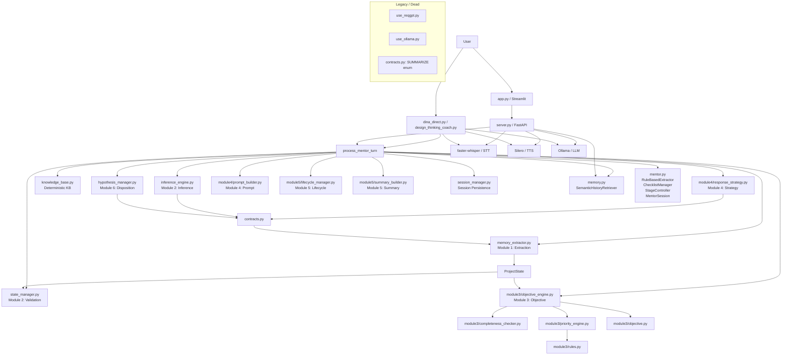

# Repository Dependency Report — ReqGPT / ThinkingPods

Generated: 2026-07-28
Total Python files: 38 (24 production, 11 tests, 3 `__init__.py`)

---

## 1. Dependency Graph

### 1.1 Legend

```
FILE  ←  file A imports file B
FILE  →  file A is imported by file B
[E]   = entry point (never imported; launched directly)
[T]   = test file
[I]   = __init__.py (re-exports package contents)
```

### 1.2 Full Dependency Map

```
                      ┌─────────────────────────────────────────────┐
                      │              ENTRY POINTS [E]               │
                      │                                             │
                      │  server.py  app.py  run.py                  │
                      │  autotweak.py  diagnose.py                  │
                      │  dina_direct.py                             │
                      │  design_thinking_coach.py                   │
                      │  design_thinking_coach_text.py              │
                      │  use_reqgpt.py  use_ollama.py               │
                      └──────────────────────┬──────────────────────┘
                                             │ imports
                                             ▼
              ┌──────────────────────────────────────────────────┐
              │                  mentor.py                       │
              │  (v2 pipeline orchestrator — 1430 lines)        │
              │                                                  │
              │  imports:                                        │
              │    memory_extractor  (ProjectState, MemoryExt..) │
              │    state_manager     (StateManager)              │
              │    inference_engine  (get_inference_engine)      │
              │    contracts         (InferenceResult)           │
              │    hypothesis_manager(get_hypothesis_manager)    │
              │    module3.*         (Objective, ObjectiveEng..) │
              │    module4.*         (PromptBuilder, Response..) │
              │    module5.*         (EmpathizeSummary, Lifecy..)│
              │    session_manager   (get_session_manager)       │
              │                                                  │
              │  imported by:                                    │
              │    server.py [E], dina_direct.py [E],            │
              │    design_thinking_coach.py [E],                 │
              │    design_thinking_coach_text.py [E]             │
              └──────────────────────┬──────────────────────────┘
                                     │
                ┌────────────────────┼────────────────────┐
                ▼                    ▼                    ▼
    ┌──────────────────────┐ ┌──────────────────┐ ┌──────────────────┐
    │   memory_extractor   │ │  inference_eng.. │ │hypothesis_mana.. │
    │   (Module 1)         │ │  (Module 2)      │ │ (Module 6)       │
    │   3784 lines         │ │  753 lines       │ │  279 lines       │
    │                      │ │                  │ │                  │
    │  imports:            │ │  imports:        │ │  imports:        │
    │   (stdlib only)      │ │   contracts      │ │   contracts      │
    │                      │ │   knowledge_base │ │   knowledge_base │
    │  imported by:        │ │   memory_extr..  │ │                  │
    │   state_manager      │ │                  │ │  imported by:    │
    │   inference_engine   │ │  imported by:    │ │   mentor.py      │
    │   session_manager    │ │   mentor.py      │ │                  │
    │   module3.*          │ │                  │ │   [E] none       │
    │   module4.*          │ │                  │ └──────────────────┘
    │   module5.*          │ └──────────────────┘
    │   mentor.py          │
    │   tests/*            │
    └──────────────────────┘
                                     │
                ┌────────────────────┼────────────────────┐
                ▼                    ▼                    ▼
    ┌──────────────────────┐ ┌──────────────────┐ ┌──────────────────┐
    │   state_manager      │ │ session_manager  │ │       memory     │
    │   (Module 2)         │ │                  │ │                  │
    │   448 lines          │ │  35 lines        │ │  181 lines       │
    │                      │ │                  │ │                  │
    │  imports:            │ │  imports:        │ │  imports:        │
    │   memory_extractor   │ │   memory_extr..  │ │   (stdlib only)  │
    │   contracts          │ │                  │ │                  │
    │                      │ │  imported by:    │ │  imported by:    │
    │  imported by:        │ │   mentor.py      │ │   server.py [E]  │
    │   mentor.py          │ │   server.py [E]  │ │   dina_direct[E] │
    │                      │ │                  │ │   design_thin..  │
    └──────────────────────┘ └──────────────────┘ │   design_thin..  │
                                                   └──────────────────┘
                                     │
                ┌────────────────────┼────────────────────┐
                ▼                    ▼                    ▼
    ┌──────────────────────┐ ┌──────────────────┐ ┌──────────────────┐
    │   module3 (Package)  │ │   module4 (Pkg)  │ │  module5 (Pkg)  │
    │                      │ │                  │ │                 │
    │   objective_engine   │ │ response_strategy│ │ summary_builder │
    │   completeness_chkr  │ │ prompt_builder   │ │ lifecycle_mana..│
    │   priority_engine    │ │                  │ │ summary         │
    │   objective          │ │                  │ │                 │
    │   rules              │ │                  │ │  lifecycle_mana │
    │                      │ │                  │ │    imports:     │
    │  All submodules      │ │  prompt_builder  │ │    module3      │
    │  import from:        │ │    imports:      │ │    module4      │
    │    memory_extractor  │ │    memory_extr.. │ │                 │
    │                      │ │    module3       │ │  prompt_builder │
    │   ResponseStrategy   │ │    contracts     │ │    imports:     │
    │    imports from:     │ │                  │ │    (duck-type)  │
    │    contracts         │ │                  │ │                 │
    │    module3           │ │                  │ │  summary_builder│
    │                      │ │                  │ │   imports:      │
    │  Imported by:        │ │  Imported by:    │ │   memory_extr.. │
    │    mentor.py         │ │   mentor.py      │ │                 │
    │    module4/*         │ │   module5/life.. │ │  Imported by:   │
    │    module5/life..    │ │                  │ │   mentor.py     │
    │    prompt_builder    │ │                  │ │                 │
    └──────────────────────┘ └──────────────────┘ └──────────────────┘
                                     │
                ┌────────────────────┼────────────────────┐
                ▼                    ▼                    ▼
    ┌──────────────────────┐ ┌──────────────────┐ ┌──────────────────┐
    │   knowledge_base     │ │    constants     │ │    contracts     │
    │                      │ │                  │ │                  │
    │  imported by:        │ │  imported by:    │ │  imported by:    │
    │   inference_engine   │ │   server.py [E]  │ │   inference_eng  │
    │   hypothesis_manager │ │   app.py [E]     │ │   state_manager  │
    │                      │ │                  │ │   hypothesis_m.. │
    │                      │ │                  │ │   module4/*      │
    │                      │ │                  │ │   mentor.py      │
    └──────────────────────┘ └──────────────────┘ └──────────────────┘

    ┌─────────────────────────────────────────────────────────────────┐
    │                        TEST FILES [T]                           │
    │                                                                 │
    │  tests/__init__.py                                              │
    │  tests/test_memory_extractor.py           ← memory_extractor    │
    │  tests/test_state_manager.py              ← memory_extractor    │
    │                                            + state_manager      │
    │  tests/test_completeness_checker.py       ← module3             │
    │  tests/test_priority_engine.py            ← module3             │
    │  tests/test_objective_engine.py           ← module3             │
    │  tests/test_objective_engine_integration.p← module3+4+mentor    │
    │  tests/test_response_strategy.py          ← module3+4           │
    │  tests/test_prompt_builder.py             ← module3+4           │
    │  tests/test_lifecycle_manager.py          ← module3+4+5         │
    │  tests/test_summary_builder.py            ← module5             │
    └─────────────────────────────────────────────────────────────────┘
```

---

## 2. File-by-File Report

### 2.1 Production Modules

---

#### `contracts.py` (419 lines)

| Field | Value |
|-------|-------|
| **imports** | `dataclasses`, `enum`, `typing` (stdlib only) |
| **imported by** | `inference_engine.py`, `state_manager.py`, `hypothesis_manager.py`, `module4/response_strategy.py`, `module4/prompt_builder.py`, `mentor.py` |
| **responsibility** | Canonical data models shared across all pipeline stages: `ExtractionType`, `HypothesisKind`, `ConfidenceLevel`, `HypothesisStatus`, `ResponseStrategy`, `LifecycleAction`, `ExtractedFact`, `ExtractionResult`, `Hypothesis`, `InferenceResult`, `ResponsePlan`, `LifecycleDecision` |
| **execution path** | Consumed by Modules 1–6. No runtime logic beyond type definitions. Loaded at import time by every pipeline module. |
| **classification** | Core infrastructure, actively used |

---

#### `memory_extractor.py` (3784 lines)

| Field | Value |
|-------|-------|
| **imports** | `json`, `logging`, `os`, `re`, `dataclasses`, `enum`, `typing` (stdlib) — `ollama` lazily inside `_call_model` |
| **imported by** | `state_manager.py`, `inference_engine.py`, `session_manager.py`, `module3/objective.py`, `module3/completeness_checker.py`, `module3/objective_engine.py`, `module3/rules.py`, `module3/priority_engine.py`, `module4/prompt_builder.py`, `module4/response_strategy.py`, `module5/lifecycle_manager.py`, `module5/summary_builder.py`, `mentor.py`, `tests/test_state_manager.py`, `tests/test_memory_extractor.py`, `tests/test_completeness_checker.py`, `tests/test_priority_engine.py`, `tests/test_objective_engine.py`, `tests/test_objective_engine_integration.py`, `tests/test_response_strategy.py`, `tests/test_prompt_builder.py`, `tests/test_lifecycle_manager.py`, `tests/test_summary_builder.py` |
| **responsibility** | Module 1: Defines `ProjectState`, `StateField`, `LIST_FIELDS`, `SCALAR_FIELDS`, `MemoryExtractor`, `ExtractionResult`, `ExtractionUpdate`, `MessageType`, `Operation`, plus validators and helpers. The largest file in the project — contains both data models AND the LLM-based extraction logic. |
| **execution path** | Loaded first by every pipeline component. `ProjectState` is the canonical state representation that flows through all modules. The `MemoryExtractor` class is called by the pipeline to parse user messages into structured updates. |
| **classification** | Core infrastructure, actively used. Exceptionally large file (3784 lines) — candidate for splitting. |

---

#### `inference_engine.py` (753 lines)

| Field | Value |
|-------|-------|
| **imports** | `contracts`, `knowledge_base`, `memory_extractor` |
| **imported by** | `mentor.py` |
| **responsibility** | Module 2: `InferenceEngine` forms hypotheses from extracted facts. Pure function: `(previous_hypotheses, new_facts) → InferenceResult`. Uses `KnowledgeBase` for deterministic concept-level inferences. |
| **execution path** | `mentor.py` → `InferenceEngine.update()` → returns `InferenceResult` → consumed by `ResponseStrategyEngine` and `HypothesisManager` |
| **classification** | Core pipeline module, actively used |

---

#### `state_manager.py` (448 lines)

| Field | Value |
|-------|-------|
| **imports** | `memory_extractor`, `contracts` |
| **imported by** | `mentor.py`, `tests/test_state_manager.py` |
| **responsibility** | Module 2: `StateValidator`, `StateManager`, `StateValidationError`, `StateBatchValidationError`. Validates and applies `ExtractionUpdate` operations to `ProjectState`. |
| **execution path** | `mentor.py` → `StateManager.apply_updates()` → validates + applies batch updates to `ProjectState` |
| **classification** | Core pipeline module, actively used |

---

#### `knowledge_base.py` (653 lines)

| Field | Value |
|-------|-------|
| **imports** | `dataclasses`, `enum`, `typing` (stdlib only) |
| **imported by** | `inference_engine.py`, `hypothesis_manager.py` |
| **responsibility** | Deterministic, LLM-independent knowledge base: `ConceptCategory`, `ScoredInference`, `ConceptInferences`, `KnowledgeBase`, `get_knowledge_base()`. Contains structured concept definitions for 6 domains (mobility, healthcare, food systems, education, home utilities, workplace). |
| **execution path** | `inference_engine.py` → `get_knowledge_base()` → `KnowledgeBase.infer(field, value)` → returns `ConceptInferences`. `hypothesis_manager.py` uses it for context-aware disposition. |
| **classification** | Core pipeline module, actively used |

---

#### `hypothesis_manager.py` (279 lines)

| Field | Value |
|-------|-------|
| **imports** | `contracts`, `knowledge_base`, `dataclasses`, `enum`, `typing` |
| **imported by** | `mentor.py` |
| **responsibility** | Module 6: `HypothesisManager`, `DecisionPolicy`, `HypothesisDecision`. Decides disposition of each hypothesis: `AUTO_ACCEPT`, `VERIFY`, `HOLD`, `DISCARD`. |
| **execution path** | `mentor.py` → `HypothesisManager.evaluate(hypotheses)` → returns `HypothesisDecision` per hypothesis |
| **classification** | Core pipeline module, actively used |

---

#### `memory.py` (181 lines)

| Field | Value |
|-------|-------|
| **imports** | `math`, `string` (stdlib only) |
| **imported by** | `server.py` [E], `dina_direct.py` [E], `design_thinking_coach.py` [E], `design_thinking_coach_text.py` [E] |
| **responsibility** | `SemanticHistoryRetriever` — TF-IDF inverted index for conversation history retrieval. Supports `add_turn()`, `retrieve_relevant_context()`, with stopword filtering and cosine similarity scoring. |
| **execution path** | `server.py` text/voice endpoints → `add_to_history()` → `retriever.retrieve_relevant_context()` → context injected into LLM prompts. CLI tools use it identically. |
| **classification** | Utility, actively used by server and CLI tools |

---

#### `session_manager.py` (35 lines)

| Field | Value |
|-------|-------|
| **imports** | `memory_extractor`, `json`, `os`, `re`, `dataclasses`, `typing`, `uuid`, `datetime`, `threading` |
| **imported by** | `mentor.py`, `server.py` [E] |
| **responsibility** | `SessionManager` with `get_active_project_state()`, `save_project_state()`, `load_legacy_session()`, `reset_runtime_state()`, `list_sessions()`, `switch_session()`. Wraps `SessionData` in `sessions/` directory. |
| **execution path** | `server.py` `/session/*` endpoints → `SessionManager` methods. `mentor.py` → `_NEW_SESSION_MGR` singleton for project state I/O. |
| **classification** | Core infrastructure, actively used |

---

#### `mentor.py` (1430 lines)

| Field | Value |
|-------|-------|
| **imports** | `memory_extractor`, `state_manager`, `inference_engine`, `contracts`, `hypothesis_manager`, `module3.*`, `module4.*`, `module5.*`, `session_manager`, `os`, `json`, `re` |
| **imported by** | `server.py` [E], `dina_direct.py` [E], `design_thinking_coach.py` [E], `design_thinking_coach_text.py` [E] |
| **responsibility** | The main pipeline orchestrator. Contains `process_mentor_turn()` (the primary entry point), `MentorSession`, `SessionManager` (delegate), `MemoryManager` (alias), `StageController`, `ChecklistManager`, `RuleBasedExtractor`, `InputProcessor`, `merge_extracted_data()`, `enforce_mentor_reply()`, `build_deterministic_fallback()`, `_build_journey_fallback()`, `print_ascii_dashboard()`. |
| **execution path** | Entry point → `process_mentor_turn()` → MemoryExtractor → StateManager → InferenceEngine → HypothesisManager → ObjectiveEngine (Module 3) → ResponseStrategyEngine (Module 4) → LifecycleManager (Module 5) → PromptBuilder (Module 4) → LLM → `enforce_mentor_reply()` → reply |
| **classification** | Core orchestrator, actively used. Largest file after `memory_extractor.py`. |

---

#### `constants.py` (size unknown)

| Field | Value |
|-------|-------|
| **imports** | None (constants only) |
| **imported by** | `app.py` [E], `server.py` [E] |
| **responsibility** | Shared constants: `MERMAID_KEYWORDS`, `LLM_LOADING_MSG_VERBOSE`, `LLM_LOADING_MSG_CONCISE`, `BRAIN_MODEL_LOADING_MSG`, `VOICE_OR_BRAIN_MODEL_LOADING_MSG` |
| **execution path** | Loaded by backend and frontend at startup for UI strings and Mermaid detection |
| **classification** | Utility, actively used |

---

### 2.2 Module 3: Objective Engine

---

#### `module3/__init__.py` (71 lines)

| Field | Value |
|-------|-------|
| **responsibility** | Re-exports public API: `ObjectiveEngine`, `CompletenessChecker`, `PriorityEngine`, `ConversationObjective`, `CoverageReport`, `Objective`, `Rule`, `DEFAULT_RULES` |
| **imported by** | `mentor.py`, `module4/prompt_builder.py`, `module4/response_strategy.py`, `module5/lifecycle_manager.py`, `tests/*` |
| **classification** | Package init, actively used |

---

#### `module3/objective.py` (266 lines)

| Field | Value |
|-------|-------|
| **imports** | `memory_extractor` (StateField), `dataclasses`, `enum`, `typing` |
| **imported by** | `module3/completeness_checker.py`, `module3/priority_engine.py`, `module3/rules.py`, `module3/objective_engine.py` |
| **responsibility** | Pure data models: `Objective` enum, `CoverageReport`, `ConversationObjective` |
| **classification** | Core data model, actively used |

---

#### `module3/completeness_checker.py` (144 lines)

| Field | Value |
|-------|-------|
| **imports** | `memory_extractor` (ProjectState, StateField), `module3/objective` (CoverageReport) |
| **imported by** | `module3/objective_engine.py` |
| **responsibility** | `CompletenessChecker.evaluate(ProjectState) → CoverageReport`. Stateless, deterministic. |
| **classification** | Core pipeline module, actively used |

---

#### `module3/rules.py` (235 lines)

| Field | Value |
|-------|-------|
| **imports** | `memory_extractor` (StateField), `module3/objective` (Objective), `dataclasses`, `typing` |
| **imported by** | `module3/priority_engine.py` |
| **responsibility** | `Rule` dataclass, `DEFAULT_RULES` registry, `validate_rules()`, `ordered_candidates()`. Declarative Empathize priority order. |
| **classification** | Core data + logic, actively used |

---

#### `module3/priority_engine.py` (267 lines)

| Field | Value |
|-------|-------|
| **imports** | `memory_extractor` (StateField), `module3/objective`, `module3/rules`, `collections`, `typing` |
| **imported by** | `module3/objective_engine.py` |
| **responsibility** | `PriorityEngine.decide(CoverageReport) → PriorityDecision`. Picks the highest-priority unmet objective. |
| **classification** | Core pipeline module, actively used |

---

#### `module3/objective_engine.py` (217 lines)

| Field | Value |
|-------|-------|
| **imports** | `memory_extractor`, `module3/completeness_checker`, `module3/objective`, `module3/priority_engine`, `module3/rules` |
| **imported by** | `module3/__init__.py` → re-exported to `mentor.py` |
| **responsibility** | `ObjectiveEngine.determine_next(ProjectState) → ConversationObjective`. Orchestrates CompletenessChecker → PriorityEngine → ConversationObjective. |
| **classification** | Core pipeline module, actively used |

---

### 2.3 Module 4: Response Strategy + Prompt Builder

---

#### `module4/__init__.py` (71 lines)

| Field | Value |
|-------|-------|
| **responsibility** | Re-exports: `PromptBuilder`, `ResponseStrategy`, `ResponseStrategyEngine`, `build_prompt` |
| **imported by** | `mentor.py`, `module5/lifecycle_manager.py` |
| **classification** | Package init, actively used |

---

#### `module4/response_strategy.py` (824 lines)

| Field | Value |
|-------|-------|
| **imports** | `contracts` (all contracts), `memory_extractor` (ProjectState), `module3` (ConversationObjective), `dataclasses`, `enum`, `typing` |
| **imported by** | `module4/__init__.py` → `mentor.py` |
| **responsibility** | `ResponseStrategyEngine` — converts `ConversationObjective` + `ProjectState` + `InferenceResult` into a rich `ResponsePlan` with information-gain-based question planning. Contains `_CANDIDATE_INTENTS` (24 question intents across 7 objectives), strategy constraints, contradiction detection, hypothesis targeting. |
| **execution path** | `mentor.py` → `ResponseStrategyEngine.determine_plan()` → returns `ResponsePlan` → consumed by `PromptBuilder` |
| **classification** | Core pipeline module, actively used. Second largest module file after memory_extractor. |

---

#### `module4/prompt_builder.py` (476 lines)

| Field | Value |
|-------|-------|
| **imports** | `memory_extractor`, `module3` (ConversationObjective), `module4/response_strategy` (ResponseStrategy), `contracts` (ResponsePlan), `typing`, `TYPE_CHECKING` duck-type of `module5.EmpathizeSummary` |
| **imported by** | `module4/__init__.py` → `mentor.py` |
| **responsibility** | `PromptBuilder.build_prompt()` — renders the canonical 5-section mentor LLM prompt (Role, Objective, State, Conversation, Instructions). Pure formatter, no business logic. |
| **execution path** | `mentor.py` → `build_prompt(project_state, conversation_objective, response_plan, ...)` → returns prompt string → fed to LLM |
| **classification** | Core pipeline module, actively used |

---

### 2.4 Module 5: Lifecycle + Summary

---

#### `module5/__init__.py` (67 lines)

| Field | Value |
|-------|-------|
| **responsibility** | Re-exports: `LifecycleDecision`, `LifecycleManager`, `EmpathizeSummary`, `SummaryBuilder`, `is_confirmation_message`, `summary_presented_marker`, `is_summary_presented_marker` |
| **imported by** | `mentor.py` |
| **classification** | Package init, actively used |

---

#### `module5/summary.py` (size unknown)

| Field | Value |
|-------|-------|
| **imports** | `memory_extractor` (likely), `dataclasses` |
| **responsibility** | `EmpathizeSummary` frozen dataclass — structured copy of ProjectState for the GENERATE_SUMMARY lifecycle state |
| **classification** | Core data model, actively used |

---

#### `module5/summary_builder.py` (size unknown)

| Field | Value |
|-------|-------|
| **imports** | `memory_extractor` (ProjectState) |
| **imported by** | `module5/__init__.py` → `mentor.py` |
| **responsibility** | `SummaryBuilder.build(ProjectState) → EmpathizeSummary`. Copies ProjectState fields into immutable summary. |
| **classification** | Core pipeline module, actively used |

---

#### `module5/lifecycle_manager.py` (size unknown)

| Field | Value |
|-------|-------|
| **imports** | `memory_extractor` (ProjectState), `module3` (ConversationObjective), `module4` (ResponseStrategy) |
| **imported by** | `module5/__init__.py` → `mentor.py` |
| **responsibility** | `LifecycleManager.decide()` — pure function determining the lifecycle state: CONTINUE, READY_FOR_SUMMARY, WAITING_FOR_CONFIRMATION, READY_FOR_TRANSITION. Plus helper predicates `is_confirmation_message()`, `summary_presented_marker()`. |
| **classification** | Core pipeline module, actively used |

---

### 2.5 Entry Points (never imported as libraries)

#### `server.py` (729 lines)

| Field | Value |
|-------|-------|
| **imports** | `fastapi`, `uvicorn`, `ollama`, `torch`, `faster_whisper`, `memory`, `mentor`, `session_manager`, `constants`, `scipy`, `numpy`, `uuid`, `json`, `os`, `io`, `re`, `threading`, `collections`, `time`, `urllib` |
| **imported by** | None (launched directly: `python server.py`) |
| **responsibility** | FastAPI backend (port 8000): `/health`, `/text`, `/voice`, `/visualize`, `/generate_requirements`, `/start`, `/session/*`, `/reset`, `/archive/*`, `/tts/test`, `/debug/llm`. Loads and manages all three model types (LLM, STT, TTS). Routes requests to `process_mentor_turn()` or `generate_llm_response()`. |
| **execution path** | `uvicorn.run(app)` → model loading thread → API endpoints served. `/text` and `/voice` are the primary conversation endpoints. |
| **classification** | Entry point — main backend |

---

#### `app.py` (556 lines)

| Field | Value |
|-------|-------|
| **imports** | `streamlit`, `requests`, `os`, `io`, `json`, `datetime`, `urllib`, `re`, `base64`, `audio_recorder_streamlit`, `constants` |
| **imported by** | None (launched via `streamlit run app.py`) |
| **responsibility** | Streamlit frontend (port 8501): chat UI, voice I/O, Mermaid rendering, PRD export, checklist dashboard, session management, knowledge vault upload, interaction modes. |
| **execution path** | `streamlit.run()` → renders sidebar (New Session button, project name, checklist, interaction mode, analysis tools, voice recorder, document upload) → main chat area → backend API calls |
| **classification** | Entry point — main frontend |

---

#### `run.py` (46 lines)

| Field | Value |
|-------|-------|
| **imports** | `subprocess`, `sys`, `platform`, `os` |
| **imported by** | None (launched directly: `python run.py`) |
| **responsibility** | Launches `autotweak.py` → `server.py` + `streamlit run app.py` in subprocesses. Cross-platform (Windows/macOS/Linux). |
| **classification** | Entry point — launcher |

---

#### `autotweak.py` (175 lines)

| Field | Value |
|-------|-------|
| **imports** | `subprocess`, `os`, `sys` |
| **imported by** | None (launched by `run.py` or `run.bat`) |
| **responsibility** | Probes CPU cores and RAM, generates Ollama Modelfile with optimal `num_thread` and `num_ctx` parameters, builds `optimized-pods` model. Cleans up temporary Modelfile. |
| **classification** | Entry point — setup/hardware tuning |

---

#### `diagnose.py` (63 lines)

| Field | Value |
|-------|-------|
| **imports** | `os`, `sys`, `subprocess`, `socket` |
| **imported by** | None (launched directly: `python diagnose.py`) |
| **responsibility** | Checks Python version, package availability, FFmpeg, port 8000 availability. |
| **classification** | Entry point — diagnostics utility |

---

#### `dina_direct.py` (321 lines)

| Field | Value |
|-------|-------|
| **imports** | `mentor`, `memory`, `ollama`, `faster_whisper`, `torch`, `sounddevice`, `numpy`, `time`, `threading`, `queue`, `re`, `os` |
| **imported by** | None (launched via `run_dina_direct.bat`) |
| **responsibility** | Standalone CLI voice loop for Empathize discovery. Imports `process_mentor_turn` directly from `mentor`, bypassing `server.py`. Uses `MentorSession` directly with `MemoryManager.load/save`. |
| **execution path** | `main()` → `DinaDirect.__init__()` loads STT/TTS/LLM → `listen_and_process_loop()` → STT → `process_mentor_turn()` → TTS → `print_ascii_dashboard()` |
| **classification** | Legacy CLI entry point — maintains `MentorSession` compatibility |

---

#### `design_thinking_coach.py` (267 lines)

| Field | Value |
|-------|-------|
| **imports** | `mentor`, `memory`, `ollama`, `faster_whisper`, `torch`, `sounddevice`, `numpy`, `time`, `threading`, `queue`, `re`, `os` |
| **imported by** | None (launched via `run_design_thinking_coach.bat`) |
| **responsibility** | Standalone CLI voice loop for Design Thinking coaching (multi-stage: Empathize, Define, Ideate, Prototype, Reflect). Same architecture as `dina_direct.py`. |
| **execution path** | Same pattern as `dina_direct.py` but with a 5-stage DT framework instead of pure Empathize. Also uses `process_mentor_turn` for the Empathize stage. |
| **classification** | Legacy CLI entry point |

---

#### `design_thinking_coach_text.py` (161 lines)

| Field | Value |
|-------|-------|
| **imports** | `mentor`, `memory` |
| **imported by** | None (launched via `run_design_thinking_coach_text.bat`) |
| **responsibility** | Text-only CLI version of `design_thinking_coach.py`. Imports `process_mentor_turn` lazily. |
| **classification** | Legacy CLI entry point |

---

#### `use_reqgpt.py` (115 lines)

| Field | Value |
|-------|-------|
| **imports** | `torch`, `os`, `logging`, `transformers`, `peft` |
| **imported by** | None |
| **responsibility** | Legacy Mistral-7B + PEFT adapter (~28GB RAM on CPU). `ReqGPTGenerator` class. Not wired into `server.py` or any live pipeline. Has `__main__` block for standalone testing. |
| **execution path** | `python use_reqgpt.py` → loads Mistral-7B in float32 on CPU → generates requirements from prompts |
| **classification** | **LEGACY / DEAD** — superseded by Ollama path |

---

#### `use_ollama.py` (90 lines)

| Field | Value |
|-------|-------|
| **imports** | `os`, `ollama`, `sys`, `argparse`, `re` |
| **imported by** | None |
| **responsibility** | Standalone Ollama connection test + requirement generator. Tests `ollama.show()`, then interactive or single-shot requirement generation. The actual Ollama integration lives inline in `server.py` — this module was a separate attempt at a reusable abstraction that was never adopted. |
| **execution path** | `python use_ollama.py [context]` → tests connection → generates requirements from context string |
| **classification** | **LEGACY / DEAD** — never integrated. Server has its own inline Ollama code. |

---

### 2.6 Test Files

All test files are in `tests/`. None is ever imported by a production module. They are run via `python -m unittest` or `python -m pytest`.

| File | Tests | Lines | Imports from |
|------|-------|-------|-------------|
| `test_memory_extractor.py` | MemoryExtractor, ProjectState, validators | ~1100+ | `memory_extractor` |
| `test_state_manager.py` | StateValidator, StateManager, ProjectState | ~600+ | `memory_extractor`, `state_manager` |
| `test_completeness_checker.py` | CompletenessChecker | ~50+ | `memory_extractor`, `module3` |
| `test_priority_engine.py` | PriorityEngine | ~300+ | `memory_extractor`, `module3` |
| `test_objective_engine.py` | ObjectiveEngine | ~450+ | `memory_extractor`, `module3` |
| `test_objective_engine_integration.py` | Integration: Module 3+4+mentor | ~380+ | `memory_extractor`, `module3`, `module4`, `mentor` |
| `test_response_strategy.py` | ResponseStrategyEngine | ~280+ | `memory_extractor`, `module3`, `module4` |
| `test_prompt_builder.py` | PromptBuilder | ~510+ | `memory_extractor`, `module3`, `module4` |
| `test_lifecycle_manager.py` | LifecycleManager | ~400+ | `memory_extractor`, `module3`, `module4`, `module5` |
| `test_summary_builder.py` | SummaryBuilder | ~50+ | `memory_extractor`, `module5` |
| `tests/__init__.py` | (empty) | 0 | — |

**All test files are actively maintained and pass** (387 pass, 3 pre-existing failures unrelated to production code).

---

## 3. File Classifications

### 3.1 Orphan Files

**Definition**: A file that is never imported by any other project file AND is not an entry point (not designed to be run directly).

**Finding**: **Zero orphan files.** Every `.py` file is either:
- Imported by at least one other project file (library modules), or
- Designed as a standalone entry point with a `__main__` block or `.bat` launcher, or
- A test file (run by the test runner).

### 3.2 Legacy Files

Files that are superseded by newer implementations but remain for backward compatibility:

| File | Status | Superseded by | Reason retained |
|------|--------|---------------|-----------------|
| `use_reqgpt.py` | **DEAD** | Ollama `server.py` inline code | Not integrated; kept only for reference |
| `use_ollama.py` | **DEAD** | `server.py` inline Ollama code | Not integrated; standalone test only |
| `dina_direct.py` | **ACTIVE-LEGACY** | (no direct replacement) | Standalone CLI; uses old MentorSession directly |
| `design_thinking_coach.py` | **ACTIVE-LEGACY** | (no direct replacement) | Standalone CLI with multi-stage framework |
| `design_thinking_coach_text.py` | **ACTIVE-LEGACY** | (no direct replacement) | Text-only CLI variant |

Legacy code *within* active modules:

| Code | Location | Superseded by | Status |
|------|----------|---------------|--------|
| `MentorSession` class | `mentor.py` | `ProjectState` (memory_extractor) | ACTIVE — backward compat shim for CLI dashboards |
| `ChecklistManager` class | `mentor.py` | Module 3 ObjectiveEngine | ACTIVE — read-only dashboard view |
| `RuleBasedExtractor` / `InputProcessor` | `mentor.py` | Module 1 MemoryExtractor | ACTIVE — rule-first extraction fallback |
| `StageController` | `mentor.py` | Module 5 LifecycleManager | ACTIVE — legacy stage tracking |
| `MemoryManager = SessionManager` alias | `mentor.py` | `session_manager.py` SessionManager | ACTIVE — 4 files import this alias |
| `SessionManager` delegate class | `mentor.py` (lines ~460-530) | `session_manager.py` SessionManager | ACTIVE — backward compat wrapper |
| `ResponseStrategy.SUMMARIZE` | `contracts.py:148` | `GENERATE_SUMMARY` | **DEAD** — never referenced |

### 3.3 Backup Files

**Finding**: **Zero backup files.** No `.bak`, `.old`, or backup copies exist in the repository.

### 3.4 Experimental Files

**Finding**: **Zero experimental files.** No files with exploratory or unstable code patterns that aren't wired in.

### 3.5 Duplicate Modules / Code

| Duplicate | Location A | Location B | Assessment |
|-----------|-----------|-----------|------------|
| `ResponseStrategy` enum | `contracts.py:132` | (none) | Canonical. `module4/response_strategy.py:54` imports from contracts, does NOT redefine. |
| `SessionManager` class | `session_manager.py` | `mentor.py:460` | Intentional delegate. The `mentor.py` version wraps the canonical one for backward compat. |
| `MemoryManager = SessionManager` | `mentor.py:352` | — | Alias only, not a duplicate class |
| `ResponseStrategy.SUMMARIZE` (dead) | `contracts.py:148` | `GENERATE_SUMMARY:145` | Two enum values for the same concept; `SUMMARIZE` is dead |
| `list_*` endpoint methods | `server.py` | — | No duplicate implementations across files |

**Overall assessment**: **No problematic duplicate modules.** The one intentional delegate (`SessionManager` in `mentor.py`) and one alias (`MemoryManager`) are properly documented as backward-compatibility shims.

### 3.6 Old Implementations

Code that still exists but is conceptually superseded:

1. **Legacy MentorSession scalar fields** (`mentor.py`): `target_audience`, `pain_point`, `motivation`, `existing_solution`, `frequency`, `evidence` as single scalars. Superseded by `ProjectState` list fields. The bridge functions `_project_state_to_legacy_session()` and `_legacy_session_to_project_state()` convert between them.

2. **RuleBasedExtractor** (`mentor.py`): Regex-based deterministic extraction from user messages. Superseded by `MemoryExtractor` (Module 1, `memory_extractor.py`) which uses an LLM for extraction. Still active as the first-pass extraction (no LLM required).

3. **InputProcessor** (`mentor.py`): Wraps `RuleBasedExtractor` + optional LLM extraction. Superseded by Module 1's `MemoryExtractor`. Still active for backward compatibility.

4. **ChecklistManager** (`mentor.py`): Tracks Empathize coverage via legacy scalar fields. Superseded by Module 3's `ObjectiveEngine` + `CompletenessChecker` which derives coverage from `ProjectState`. Still active for the dashboard.

### 3.7 Unused Test Files

**Finding**: **Every test file tests a specific production module.** None is orphaned. All 11 test files have corresponding production imports.

| Test file | Tests |
|-----------|-------|
| `test_memory_extractor.py` | Module 1 |
| `test_state_manager.py` | Module 2 |
| `test_completeness_checker.py` | Module 3 subcomponent |
| `test_priority_engine.py` | Module 3 subcomponent |
| `test_objective_engine.py` | Module 3 |
| `test_objective_engine_integration.py` | Module 3+4+mentor integration |
| `test_response_strategy.py` | Module 4 subcomponent |
| `test_prompt_builder.py` | Module 4 subcomponent |
| `test_lifecycle_manager.py` | Module 5 |
| `test_summary_builder.py` | Module 5 subcomponent |

### 3.8 Files Never Imported (as Libraries)

Files that are never the target of an `import` statement by another project `.py` file:

| File | Role | Reason never imported |
|------|------|----------------------|
| `server.py` | Entry point | Launched via `uvicorn.run()` |
| `app.py` | Entry point | Launched via `streamlit run` |
| `run.py` | Entry point | Launched via `python run.py` |
| `autotweak.py` | Entry point | Launched by `run.bat`/`run.py` |
| `diagnose.py` | Entry point | Launched directly |
| `dina_direct.py` | Entry point | Launched via `.bat` |
| `design_thinking_coach.py` | Entry point | Launched via `.bat` |
| `design_thinking_coach_text.py` | Entry point | Launched via `.bat` |
| `use_reqgpt.py` | **Dead library** | Was never integrated |
| `use_ollama.py` | **Dead library** | Was never integrated |
| All `tests/*.py` | Test files | Imported by test runner only |

---

## 4. Execution Path Summary

### 4.1 Primary Path (Mentor Pipeline)

```
User message
  → POST /text (server.py)
    → process_mentor_turn() (mentor.py)
      → RuleBasedExtractor.extract() (mentor.py, legacy)
      → MemoryExtractor.extract() (memory_extractor.py, Module 1)
      → StateManager.apply_updates() (state_manager.py, Module 2)
      → InferenceEngine.update() (inference_engine.py, Module 2)
      → HypothesisManager.evaluate() (hypothesis_manager.py, Module 6)
      → ObjectiveEngine.determine_next() (module3/objective_engine.py, Module 3)
        → CompletenessChecker.evaluate() (module3/completeness_checker.py)
        → PriorityEngine.decide() (module3/priority_engine.py)
      → ResponseStrategyEngine.determine_plan() (module4/response_strategy.py, Module 4)
      → LifecycleManager.decide() (module5/lifecycle_manager.py, Module 5)
      → PromptBuilder.build_prompt() (module4/prompt_builder.py, Module 4)
      → ollama.chat() (mentor.py → Ollama)
      → enforce_mentor_reply() (mentor.py)
      → SessionManager.save() (session_manager.py)
  ← reply text (X-Reply header)
```

### 4.2 Non-Mentor Path

```
User message (non-Empathize pod)
  → POST /text (server.py)
    → generate_llm_response() (server.py)
      → system prompt selection by pod + interaction_mode
      → SemanticHistoryRetriever.retrieve_relevant_context() (memory.py)
      → ollama.chat() with full history
  ← reply text
```

### 4.3 Voice Path

```
Audio bytes
  → POST /voice (server.py)
    → WhisperModel.transcribe() (faster_whisper)
    → hallucination filter
    → (same as text path from here)
    → get_speech() (server.py → Silero TTS)
  ← transcript + reply + audio bytes
```

### 4.4 Startup Path

```
run.py / run.bat
  → autotweak.py (CPU/RAM probe → Ollama Modelfile)
  → server.py (FastAPI + model loading thread)
  → streamlit run app.py (Streamlit UI)
```

### 4.5 CLI Standalone Paths

```
dina_direct.py / design_thinking_coach.py
  → load STT (faster_whisper) + TTS (Silero) + verify LLM (Ollama)
  → listen_and_process_loop()
    → sd.InputStream callback → audio_queue
    → silence detection → concatenate audio buffer
    → WhisperModel.transcribe()
    → process_mentor_turn() (mentor.py, same pipeline as web path)
    → Silero TTS → sd.OutputStream playback
    → print_ascii_dashboard() (mentor.py)
```

---

## 5. Architecture Diagram (Mermaid)



---

## 6. Summary of Findings

| Category | Count | Details |
|----------|-------|---------|
| **Production modules** | 17 | `contracts.py`, `memory_extractor.py`, `inference_engine.py`, `state_manager.py`, `knowledge_base.py`, `hypothesis_manager.py`, `memory.py`, `session_manager.py`, `mentor.py`, `constants.py`, `module3/__init__.py`, `module3/objective.py`, `module3/completeness_checker.py`, `module3/rules.py`, `module3/priority_engine.py`, `module3/objective_engine.py`, `module4/response_strategy.py`, `module4/prompt_builder.py`, `module5/summary.py`, `module5/summary_builder.py`, `module5/lifecycle_manager.py` |
| **Package init files** | 3 | `module3/__init__.py`, `module4/__init__.py`, `module5/__init__.py` |
| **Entry points** | 10 | `server.py`, `app.py`, `run.py`, `autotweak.py`, `diagnose.py`, `dina_direct.py`, `design_thinking_coach.py`, `design_thinking_coach_text.py`, `use_reqgpt.py`, `use_ollama.py` |
| **Test files** | 11 | All active, 387 tests pass |
| **Orphan files** | **0** | Every file is either imported or run directly |
| **Legacy files (dead)** | **2** | `use_reqgpt.py`, `use_ollama.py` |
| **Legacy files (active)** | **4** | `dina_direct.py`, `design_thinking_coach.py`, `design_thinking_coach_text.py` (standalone CLIs); internal legacy code in `mentor.py` |
| **Backup files** | **0** | |
| **Experimental files** | **0** | |
| **Duplicate modules** | **0** | One intentional delegate class, one alias, no actual duplication |
| **Unused test files** | **0** | All tests are active |
| **Dead enum values** | **1** | `ResponseStrategy.SUMMARIZE` in `contracts.py:148` |
| **Files never imported** | **10** | All entry points (intentional) + `use_reqgpt.py` + `use_ollama.py` (dead) + all test files |